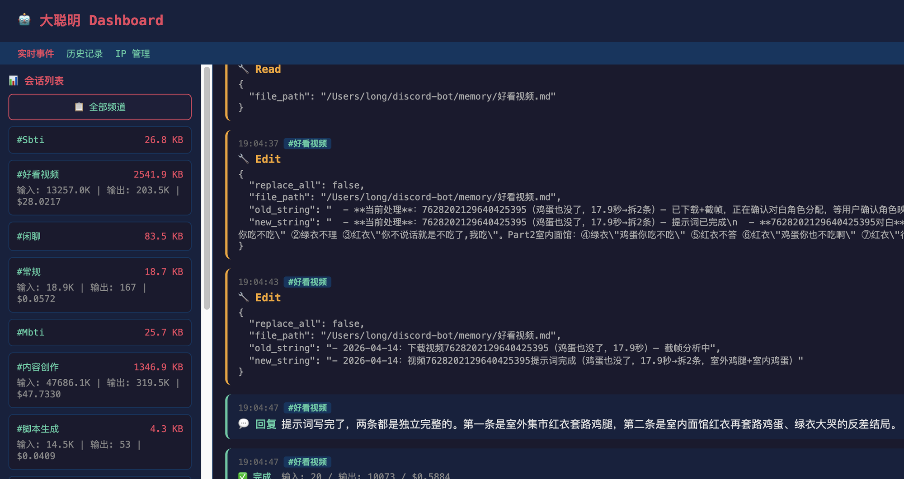
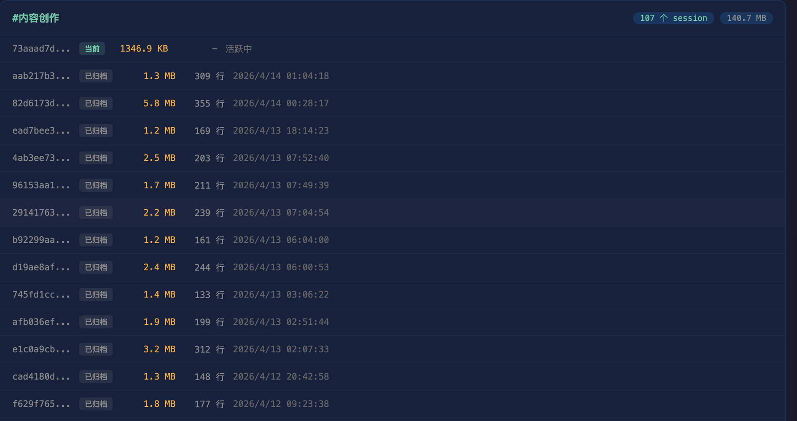

# Claude Memory Bot

[English](./README_EN.md) | 中文

> 基于 Claude CLI 的 AI Bot 框架，自带持久记忆系统




## 特性

- **持久记忆** -- 热冷分离、踩坑置顶、代码级保障，跨 Session 不丢失关键信息
- **Session 自动管理** -- 轮转、上下文延续、Resume 重试容错
- **多平台支持** -- 目前支持 Discord，Telegram 等可通过继承 BaseGateway 扩展
- **Web 监控看板** -- 本地实时看板 + 可选远程部署
- **全格式文件解析** -- PDF / DOCX / XLSX / PPTX / ZIP / EPUB / 音视频
- **安全保护** -- 403 熔断、进程 Watchdog、卡死检测

## 快速开始

```bash
git clone https://github.com/460065581-star/claude-memory-bot.git
cd claude-memory-bot
npm install
cp .env.example .env
# 编辑 .env 填入 DISCORD_BOT_TOKEN
npm start
```

## 前置要求

- **Node.js** 18+
- **Claude CLI** -- 已安装并可用（`claude --version` 能正常输出）
- **Claude Max 订阅**或 API key（Claude CLI 需要有效的认证）
- **Discord Bot Token** -- 从 [Discord Developer Portal](https://discord.com/developers/applications) 获取

## 配置说明

| 文件 | 作用 |
|------|------|
| `.env` | 环境变量：Bot Token、端口、远程看板地址等敏感配置 |
| `config.json` | 运行时配置：默认系统提示词、频道级提示词覆盖 |
| `CLAUDE.md` | Claude CLI 自动加载的行为规则，定义记忆管理指南、操作规范 |
| `soul.md` | Bot 的性格定义，影响说话风格和行为偏好 |

### .env 变量

```bash
# 必填
DISCORD_BOT_TOKEN=your_discord_bot_token_here

# 可选
GATEWAY=discord              # 平台选择，默认 discord
CLAUDE_CLI_PATH=claude       # Claude CLI 路径
WEB_PORT=18792               # 本地看板端口
REMOTE_DASHBOARD_URL=        # 远程看板推送地址
REMOTE_API_SECRET=           # 远程看板密钥
```

## 记忆系统

Bot 通过三层保障实现跨 Session 记忆：

1. **文件记忆（主力）** -- Bot 通过 Write/Edit 工具写入记忆文件，新 Session 启动时自动加载到 system prompt
2. **对话延续（桥梁）** -- Session 轮转时从旧 Session 提取最近 5 轮对话注入新 Session
3. **代码保障（兜底）** -- 自动检测 Bot 是否遵守记忆规则，未遵守时插入提醒；自动记录操作日志

### 冷热分离

- **热记忆** `memory/{频道}.md` -- 每条消息自动加载，限 15KB
- **冷记忆** `memory/{频道}_archive.md` -- 不自动加载，存放历史详情，无大小限制
- 信息不会被删除，只从热记忆移到冷记忆

详见 `docs/` 目录。

## 命令

| 命令 | 说明 |
|------|------|
| `!help` | 显示帮助 |
| `!reset` | 重置当前会话（记忆自动携带到新会话） |
| `!status` | 查看当前会话大小和 Token 用量 |
| `!sessions` | 查看所有会话概览 |
| `!system` | 查看/设置当前频道的系统提示词 |

## Web 看板

### 本地看板

启动后自动开启，默认访问地址：

```
http://127.0.0.1:18792
```

提供实时事件流、Session 管理、健康监控（内存/CPU/卡死检测）。

### 远程看板

设置 `.env` 中的 `REMOTE_DASHBOARD_URL` 和 `REMOTE_API_SECRET` 后自动推送。远程看板部署在 `remote-dashboard/` 目录：

```bash
cd remote-dashboard
npm install
node server.js
```

## 目录结构

```
claude-memory-bot/
├── src/
│   ├── index.js                  # 入口文件
│   ├── core/
│   │   ├── claude-cli.js         # Claude CLI 调用、watchdog、403 熔断
│   │   ├── session-manager.js    # Session 映射、轮转、历史
│   │   ├── memory-manager.js     # 记忆加载、提醒、activity log
│   │   ├── config.js             # 配置管理、路径计算
│   │   ├── event-bus.js          # 全局事件总线
│   │   ├── file-parser.js        # 全格式文件解析
│   │   └── utils.js              # UUID、消息分割等工具
│   ├── gateway/
│   │   ├── base-gateway.js       # 网关抽象基类
│   │   └── discord.js            # Discord 网关实现
│   └── dashboard/
│       ├── local-server.js       # 本地 HTTP 看板服务
│       ├── local-pages.js        # 看板 HTML 页面
│       └── remote-pusher.js      # 远程看板事件推送
├── remote-dashboard/             # 远程看板独立服务
│   ├── server.js
│   └── pages.js
├── memory/                       # 记忆文件目录
│   └── global.md                 # 全局共享记忆
├── docs/                         # 文档
├── CLAUDE.md                     # Claude CLI 行为规则
├── soul.md                       # Bot 性格定义
├── config.json                   # 运行时配置
├── .env.example                  # 环境变量模板
├── package.json
└── LICENSE
```

## 添加新平台

继承 `BaseGateway` 并实现以下方法：

```javascript
const { BaseGateway } = require('../gateway/base-gateway')

class TelegramGateway extends BaseGateway {
  constructor() {
    super('telegram', { messageLimit: 4096 })
  }

  async start() { /* 连接 Telegram Bot API */ }
  async stop() { /* 断开连接 */ }
  async fetchChannelNames() { /* 返回 Map<chatId, name> */ }
  async sendMessage(chatId, text) { /* 发送文本 */ }
  async sendFile(chatId, filePath, filename) { /* 发送文件 */ }
  async showTyping(chatId) { /* 显示输入状态 */ }
}
```

消息处理调用 `this.handleMessage(msg)` 即可，基类会自动完成：频道注册、记忆提醒、排队调用 Claude、分段发送回复。

## License

MIT
